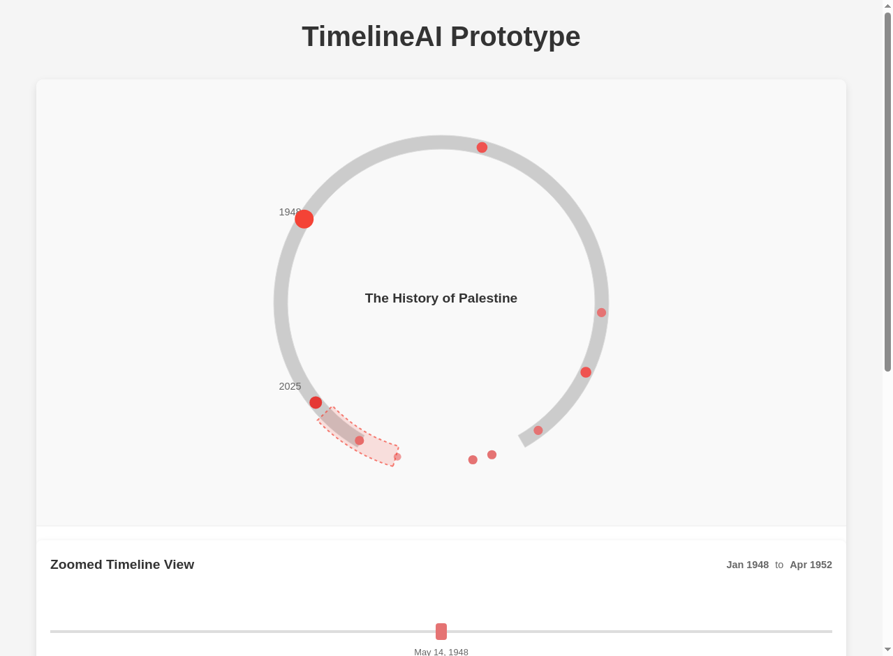
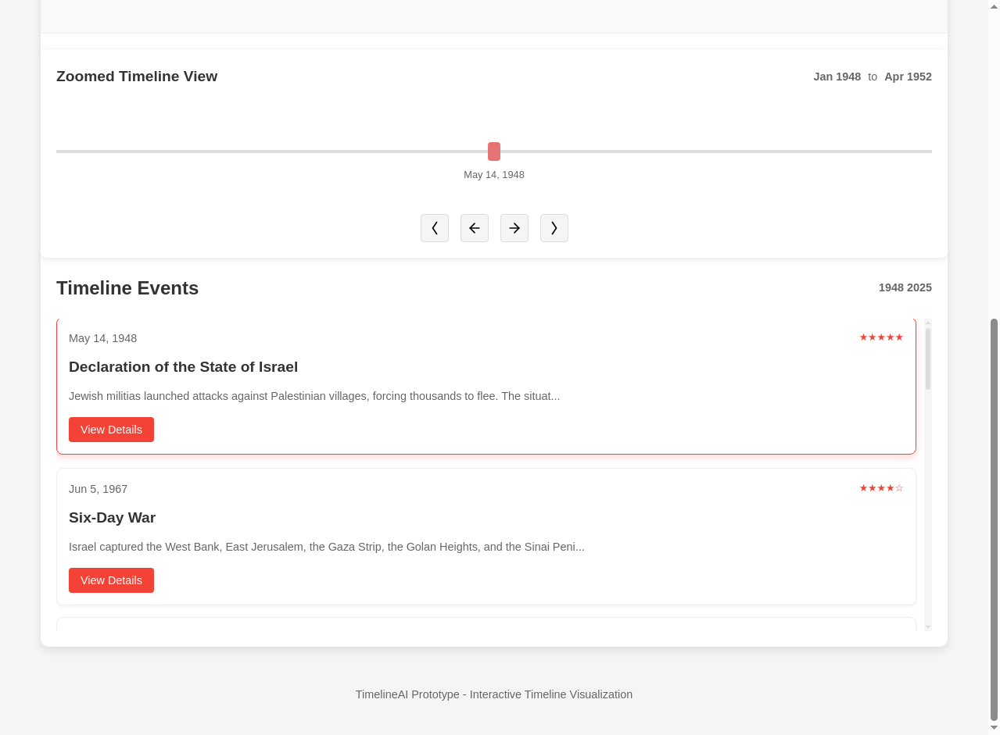
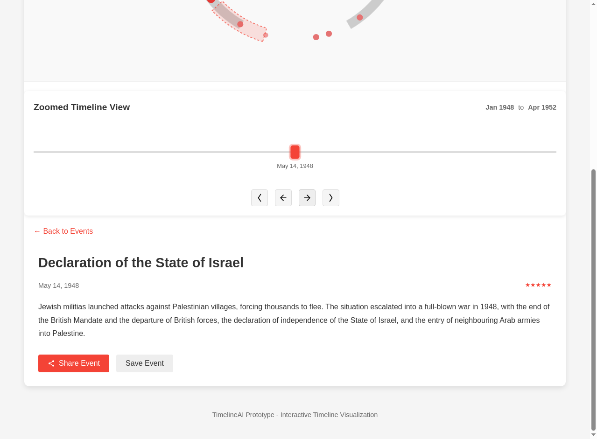
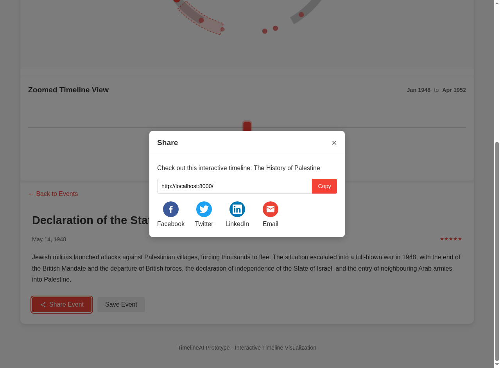

# TimelineAI Prototype - User Guide

## Introduction

Welcome to the enhanced TimelineAI Prototype! This interactive timeline visualization tool allows you to explore historical events through multiple synchronized views. This guide will help you understand how to use all the features of the application.

## Main Components

The TimelineAI prototype consists of four main components:

1. **Circular Timeline** - A 300-degree circular visualization of all events
2. **Zoomed Timeline** - A horizontal view showing a 30-degree portion of the timeline
3. **Card Summary View** - Scrollable cards showing event summaries
4. **Event Detail View** - Comprehensive information about a selected event

## How to Navigate

### Using the Circular Timeline

- **View All Events**: The circular timeline shows all events in the dataset positioned around a 300-degree arc
- **Select an Event**: Click on any red dot (event marker) to select that event
- **Zoom Indicator**: The highlighted arc segment shows which portion is currently displayed in the zoomed view
- **Navigate Between Events**: Use the arrow buttons at the bottom of the circle to move to the previous or next event

### Using the Zoomed Timeline

- **Focused View**: Shows only events within a 30-degree portion of the timeline
- **Pan Left/Right**: Use the arrow buttons to move the view along the timeline
- **Zoom In/Out**: Use the zoom buttons to adjust the level of detail
- **Select Events**: Click on any marker to select that event
- **Date Range**: The current date range is displayed at the top of the view

### Using the Card Summary View

- **Browse Events**: Scroll through the cards to see all events in chronological order
- **Event Information**: Each card shows the date, importance rating (stars), title, and a brief description
- **Select an Event**: Click on any card to select it (this will update all other views)
- **View Details**: Click the "View Details" button to see comprehensive information about the event

### Using the Event Detail View

- **Complete Information**: Read the full description and metadata for the selected event
- **Share Event**: Click the "Share Event" button to share via social media or copy a direct link
- **Save Event**: Click the "Save Event" button to save the event (placeholder functionality)
- **Return to Cards**: Click the "Back to Events" button to return to the card summary view

## Special Features

### Social Sharing

1. Click the "Share Event" button in the event detail view
2. Choose from multiple sharing options:
   - Copy the direct link using the "Copy" button
   - Share to Facebook, Twitter, LinkedIn, or via Email
   - Each platform opens in a new window with pre-populated content

### Mobile Experience

The application is fully responsive and optimized for mobile devices:

- **Touch Gestures**: Swipe left/right to navigate between events
- **Responsive Layout**: The interface adjusts automatically to fit your screen size
- **Enhanced Touch Targets**: Buttons and interactive elements are sized appropriately for touch

## Keyboard Shortcuts

For desktop users, the following keyboard shortcuts are available:

- **Left Arrow (←)**: Navigate to the previous event
- **Right Arrow (→)**: Navigate to the next event
- **Escape (Esc)**: Return from detail view to card view

## Tips for Best Experience

1. **Explore the Connection**: Notice how selecting an event in one view updates all other views
2. **Use the Zoomed View**: For detailed exploration of specific time periods
3. **Try Different Devices**: The experience is optimized for both desktop and mobile
4. **Share Interesting Events**: Use the sharing functionality to share discoveries with others

## Technical Requirements

- Modern web browser (Chrome, Firefox, Safari, or Edge)
- JavaScript enabled
- Internet connection (for loading external resources and sharing)

Enjoy exploring the timeline!
