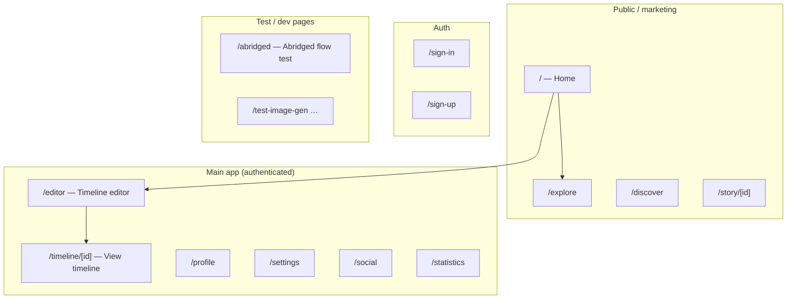
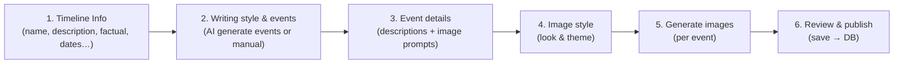
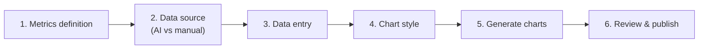
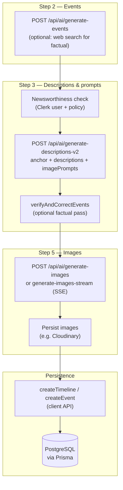
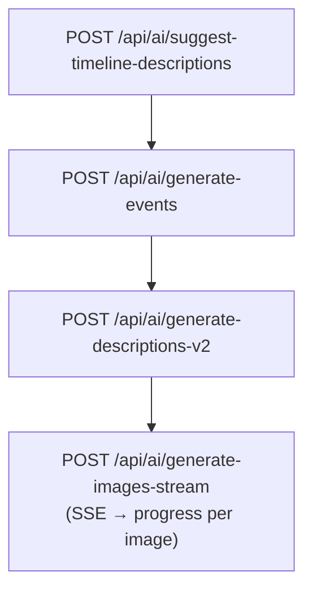
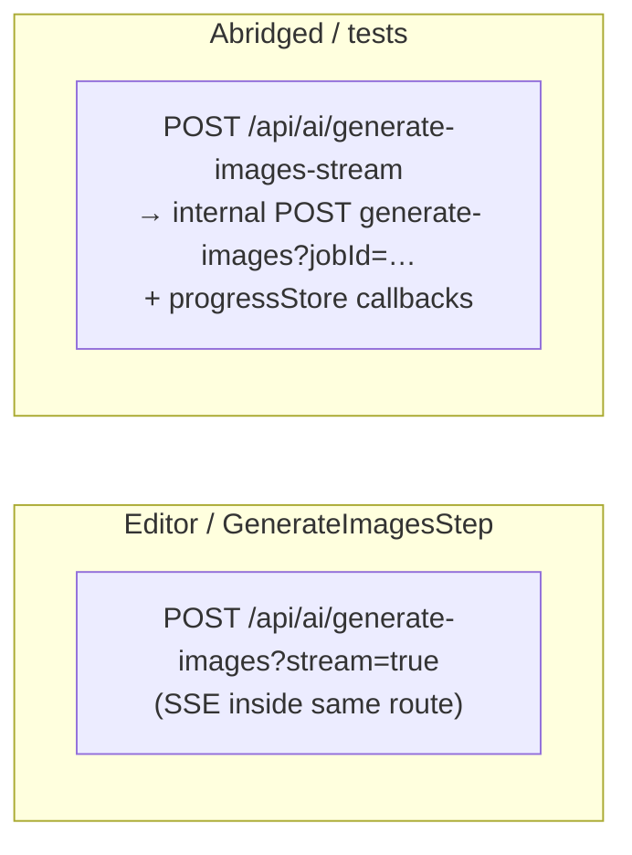
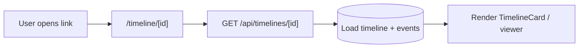

# StoryWall — Application flow (visual)

Use a Mermaid-capable viewer (GitHub preview, VS Code extension, [mermaid.live](https://mermaid.live)) to render the diagrams below.

---

## 1. High-level: main surfaces

---

## 2. Standard timeline editor (6 steps)

Default path when **`timelineType` ≠ statistics** (narrative / factual timelines).

---

## 3. Statistics timeline branch (6 steps)

When user enters editor from **`/statistics`** (or `?type=statistics`).

---

## 4. AI pipeline — standard timeline (conceptual)

What typically runs **between** editor steps (not every button hits every box).

---

## 5. Abridged test page flow (`/abridged`)

Simplified end-to-end test (guest-friendly header); not the full editor.

---

## 6. Image generation — two streaming patterns

---

## 7. Viewing a saved timeline

---

### Sharing & SEO

Timeline and **story** (`/story/[id]`) routes use server metadata (`generateMetadata`); timelines also use server-fetched data for faster first paint. **`/sitemap.xml`** and **`/robots.txt`** list public timelines for crawlers — see **[SHARING_AND_SEO.md](./SHARING_AND_SEO.md)**. After deploys, refresh social caches there too.

---

### Notes

- **Auth:** `/editor` expects a signed-in Clerk user (redirects to `/sign-in` if not).
- **Credits:** Image generation may deduct credits (guest/abridged flows may bypass or use different rules — see route handlers).
- **AI provider:** Controlled by env (`AI_PROVIDER`, OpenAI vs Kimi, etc.); not every route uses the same model — see in-code `createChatCompletion` / `getModelForProvider` usage per feature.
